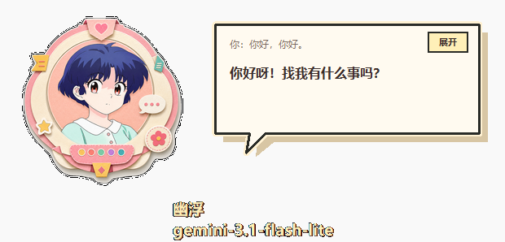
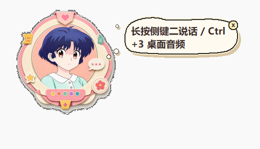

<a id="top"></a>

<div align="center">

# Youfu

**A Windows floating voice assistant. Hold to talk, release to send, and hear it answer.**

<p>
  <a href="./README.md">中文</a> · English
</p>

<p>
  <a href="https://www.microsoft.com/windows">
    
  </a>
  <a href="https://www.python.org/">
    
  </a>
  <a href="https://ai.google.dev/gemini-api/docs">
    
  </a>
  <a href="https://elevenlabs.io/docs">
    
  </a>
  <a href="./LICENSE">
    
  </a>
</p>

<p>
  <a href="#screenshots">Screenshots</a> ·
  <a href="#features">Features</a> ·
  <a href="#quick-start">Quick Start</a> ·
  <a href="#configuration">Configuration</a> ·
  <a href="#audio-input-compatibility">Audio Input</a> ·
  <a href="#build">Build</a> ·
  <a href="#diagnostics">Diagnostics</a>
</p>

</div>

> [!NOTE]
> Youfu is a local Windows desktop app. [`web/`](./web) is only kept as a local debug surface.

<a id="screenshots"></a>

## Screenshots

<p align="center">
  
</p>

<p align="center">
  
</p>

<a id="features"></a>

## Features

| Area | Description |
| --- | --- |
| Floating orb | Always-on-top desktop orb with dragging, context menu, startup launch, opacity, edge docking, and skins. |
| Voice input | Hold a shortcut to record microphone audio, release to send, or cancel the current recording. |
| Desktop audio | Capture system audio separately so the model can understand videos, meetings, or media playback. |
| Multimodal input | Gemini-format gateways can receive audio and screenshots directly; screenshots can be attached during recording. |
| AI gateway | Supports Gemini, OpenAI-compatible, and Anthropic-compatible gateway formats. |
| Voice output | Uses ElevenLabs to generate spoken replies and plays them on the desktop. |
| Chat bubble | Comic-style bubble with streaming text, expanded view, scrolling, and user transcript display. |
| Persona | Uses [`prompts/persona.md`](./prompts/persona.md) to control speaking style. |
| Session memory | Keeps recent context and summarizes long conversations instead of growing forever. |
| Diagnostics | Optional turn logs for audio, transcript, model output, and TTS playback. |

<p align="right"><a href="#top">Back to top</a></p>

<a id="how-it-works"></a>

## How It Works

```text
Microphone / desktop audio / screenshot
-> AI gateway understands the input
-> persona + session context
-> structured user_text and assistant_text
-> ElevenLabs generates speech
-> floating orb plays audio and streams text
```

With Gemini format, audio and images are sent directly to the model. The model returns:

```json
{
  "user_text": "what the user said, or [no speech]",
  "assistant_text": "the assistant reply"
}
```

`user_text` is the model's understanding of the audio. It is used for display, diagnostics, and session memory. It is not a fixed local transcript, so short noisy recordings can be checked through the diagnostic log.

<p align="right"><a href="#top">Back to top</a></p>

<a id="audio-input-compatibility"></a>

## Audio Input Compatibility

Youfu does not use the same audio protocol for every gateway format. The current behavior is:

| Gateway format | Audio handling | Screenshot handling | Status |
| --- | --- | --- | --- |
| Gemini | Sends audio directly through `inline_data`. | Sends images directly through `inline_data`. | Recommended and most complete. |
| OpenAI-compatible | Sends base64 audio as `input_audio` inside Chat Completions message content. | Sends images as `image_url` data URLs. | Not a separate transcription step, but your gateway and model must support `input_audio`. |
| Anthropic-compatible | The app does not send audio in this format. | The app does not send screenshots in this format. | Voice turns fail by design; text turns are supported. |

So OpenAI-compatible mode follows the same product idea as Gemini: the model receives the audio directly and is asked to return `user_text` and `assistant_text`. The wire format is different, and compatibility depends on your gateway implementation. Anthropic-compatible mode is not equivalent to Gemini for voice turns in the current version.

To support voice turns through Anthropic-compatible models, the app would need a transcription step first: audio to text, then text to Anthropic. This version does not do that by default.

<p align="right"><a href="#top">Back to top</a></p>

<a id="quick-start"></a>

## Quick Start

Install dependencies:

```powershell
python -m pip install -r requirements.txt
```

Start the desktop orb:

```powershell
.\run_desktop.ps1
```

Or run the Python entry directly:

```powershell
python .\desktop_orb.py
```

On first launch, open settings from the orb context menu and fill in your AI gateway and ElevenLabs configuration.

<a id="shortcuts"></a>

## Shortcuts

| Action | Default |
| --- | --- |
| Microphone hold-to-talk | Mouse side button 2 |
| Desktop audio input | Ctrl+3 |
| Attach screenshot while recording | Alt |
| Cancel current recording | Middle mouse button |

All keyboard and mouse triggers can be changed in **Settings -> Shortcuts**. You can record either a single key/button or a modifier combination.

<p align="right"><a href="#top">Back to top</a></p>

<a id="configuration"></a>

## Configuration

Most options can be changed from the orb context menu through **Settings**. The same state is stored in these files.

| File | Purpose |
| --- | --- |
| [`gemini_config.json`](./gemini_config.json) | AI model, gateway base URL, gateway key, and provider format. |
| [`tts_config.json`](./tts_config.json) | ElevenLabs key, voice ID, TTS model, and output format. |
| [`.env.example`](./.env.example) | Example local environment variables. |
| [`desktop_config.json`](./desktop_config.json) | Orb name, skin, size, opacity, docking, hint bubble, and shortcuts. |
| [`session_config.json`](./session_config.json) | Session memory, summary threshold, and context length. |
| [`prompts/persona.md`](./prompts/persona.md) | Voice persona and reply style. |
| [`skins/`](./skins) | Skin metadata. |
| [`assets/skins/`](./assets/skins) | Skin state images. |

> [!IMPORTANT]
> Do not commit real API keys to a public repository. Use environment variables or the settings window for local secrets.

<a id="gateway-modes"></a>

## Gateway Modes

| Mode | Best for | Notes |
| --- | --- | --- |
| Gemini | Native audio and screenshot input | Recommended for this project. |
| OpenAI-compatible | Unified gateways that support `input_audio` | Can send audio directly, but the model and gateway must support it. |
| Anthropic-compatible | Text-oriented model calls | Direct audio is not supported in the current desktop voice flow. |

References:

- [Google Gemini API docs](https://ai.google.dev/gemini-api/docs)
- [ElevenLabs API docs](https://elevenlabs.io/docs)
- [PyInstaller docs](https://pyinstaller.org/)
- [sounddevice docs](https://python-sounddevice.readthedocs.io/)
- [soundcard project](https://github.com/bastibe/python-soundcard)
- [pynput docs](https://pynput.readthedocs.io/)

<p align="right"><a href="#top">Back to top</a></p>

<a id="cli-usage"></a>

## CLI Usage

Text turn:

```powershell
python .\voice_turn.py --text "Hello, help me summarize today's plan."
```

Audio turn:

```powershell
python .\voice_turn.py --audio .\input.wav
```

Audio plus screenshot:

```powershell
python .\voice_turn.py --audio .\input.wav --image .\screenshot.png
```

Desktop audio:

```powershell
python .\voice_turn.py --audio .\desktop.wav --audio-source desktop
```

New session:

```powershell
python .\voice_turn.py --new-session
```

TTS only:

```powershell
python .\tts.py "Hello, this is a TTS test." --out outputs\test.mp3
```

<a id="build"></a>

## Build

Build the Windows executable:

```powershell
.\build_exe.ps1
```

The output is generated locally at `release\幽浮\幽浮.exe`. `release/` is a generated directory and is not committed to the repository.

<p align="right"><a href="#top">Back to top</a></p>

<a id="diagnostics"></a>

## Diagnostics

When diagnostic logging is enabled, each turn is written to:

```text
logs/voice-turns.jsonl
```

Inspect recent records:

```powershell
python .\inspect_diagnostics.py --last 12
```

Use this to check:

- Whether a short accidental recording was only noise.
- Whether desktop audio came from the expected source.
- Whether the model hallucinated speech from silence or noise.
- Whether `user_text` matches the saved audio.
- Whether TTS returned a complete audio file.

<a id="project-structure"></a>

## Project Structure

| Path | Role |
| --- | --- |
| [`desktop_orb.py`](./desktop_orb.py) | Main desktop orb UI, context menu, settings window, and state transitions. |
| [`voice_turn.py`](./voice_turn.py) | One complete voice turn. |
| [`gemini_brain.py`](./gemini_brain.py) | AI gateway request logic. |
| [`gemini_audio.py`](./gemini_audio.py) | Audio and image payload handling. |
| [`tts.py`](./tts.py) | ElevenLabs speech generation. |
| [`hotkey_listener.py`](./hotkey_listener.py) | Keyboard and mouse shortcut listener. |
| [`inspect_diagnostics.py`](./inspect_diagnostics.py) | Diagnostic log viewer. |
| [`build_exe.ps1`](./build_exe.ps1) | Packaging script. |
| [`docs/images/`](./docs/images) | README screenshots. |

<a id="web-debug"></a>

## Web Debug Surface

The desktop orb is the primary UI. A local web debug surface is still available:

```powershell
.\run_web.ps1
```

```text
http://127.0.0.1:8765
```

<p align="right"><a href="#top">Back to top</a></p>

---

<div align="center">

Built for quick voice turns on the Windows desktop.

</div>
